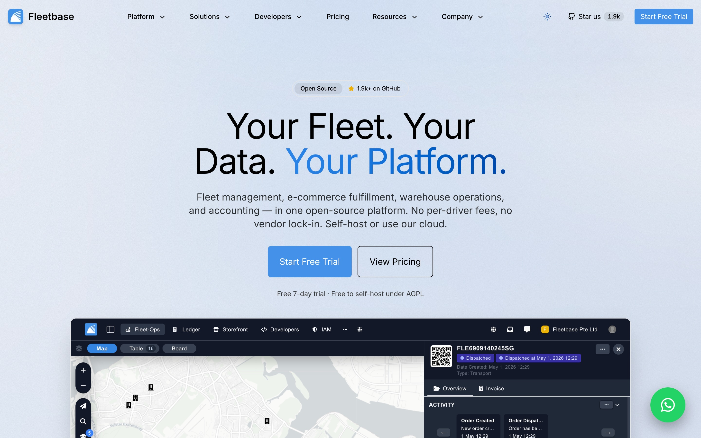

# fleetbase.io

The marketing site, documentation, and developer portal for [Fleetbase](https://fleetbase.io) — the open-source logistics and supply-chain platform.



## What's in this repo

- **Marketing site** — home, platform pages, solutions, pricing, partners, customer stories (`/oli-max`, `/true-vegan`)
- **Documentation** — Platform, FleetOps, Storefront, Pallet, Ledger, CLI, Fleetbase UI, Extension Development, API Reference, Contributing — all rendered with [Fumadocs](https://fumadocs.dev)
- **API reference generator** — auto-generates `/docs/api/*` MDX from the [`fleetbase/postman`](https://github.com/fleetbase/postman) collection at build time (see `scripts/generate-api-docs.mjs`)
- **Blog** — pulled from a Ghost CMS via the Content API
- **Customer stories** — branded landing pages for production deployments of the Fleetbase Storefront app

## Tech stack

- **Next.js 15** with the App Router
- **TypeScript**, **React 19**
- **Tailwind CSS 4** + **shadcn/ui** components
- **Fumadocs** for the documentation system (MDX + search)
- **Ghost** for blog content
- **PostHog** for product analytics
- **pnpm** for package management
- **Vercel** for hosting

## Local development

Requirements: Node.js 20+, pnpm 10+.

```bash
git clone --recurse-submodules git@github.com:fleetbase/fleetbase.io.git
cd fleetbase.io
pnpm install
pnpm dev
```

The site runs at <http://localhost:3000>.

> The `vendor/postman` git submodule supplies the API documentation source. If you cloned without `--recurse-submodules`, run `git submodule update --init --recursive` before `pnpm install`.

### Environment variables

Copy `.env.local.example` to `.env.local` and fill in the required values:

| Variable | Purpose |
| :--- | :--- |
| `NEXT_PUBLIC_POSTHOG_KEY` | PostHog project key (frontend) |
| `NEXT_PUBLIC_POSTHOG_HOST` | PostHog ingest host (e.g. `https://us.i.posthog.com`) |
| `GHOST_API_URL` | Ghost CMS base URL for the blog |
| `GHOST_CONTENT_API_KEY` | Ghost Content API key |
| `GHOST_API_VERSION` | Ghost API version (e.g. `v5.0`) |

Without the Ghost variables, blog routes fall back to an empty state. Without the PostHog variables, analytics calls no-op locally.

## Scripts

```bash
pnpm dev               # start the dev server (regenerates API docs first)
pnpm build             # production build (regenerates API docs first)
pnpm start             # serve the production build
pnpm generate:api-docs # regenerate /docs/api/* from the postman submodule
pnpm lint              # next lint
```

## Project layout

```
fleetbase.io/
├── content/            # MDX content for docs, blog, changelog
│   ├── docs/           # docs sections — platform, fleet-ops, storefront, etc.
│   ├── blog/           # blog post sources
│   └── changelog/
├── public/             # static assets
│   └── images/
│       └── screenshots/  # console + mobile app screenshots used across the site
├── scripts/            # build-time helpers
│   ├── generate-api-docs.mjs   # walks vendor/postman and emits /docs/api/* MDX
│   ├── sdk-emitters.mjs        # JS / PHP / Python SDK code samples
│   └── api-docs.config.mjs     # per-collection mapping & SDK store names
├── src/
│   ├── app/            # Next.js App Router routes
│   ├── components/     # UI components, layout, MDX components
│   └── lib/            # utilities, source loaders, GitHub stars helper
├── vendor/
│   └── postman/        # submodule — fleetbase/postman collection
├── source.config.ts    # Fumadocs MDX source registration
└── next.config.ts
```

## Documentation

Docs live in `content/docs/` as `.mdx` files. Each top-level folder (`platform/`, `fleet-ops/`, `storefront/`, etc.) is registered as its own Fumadocs source in [`src/lib/source.ts`](./src/lib/source.ts) and gets its own sidebar.

The API reference under `/docs/api/*` is **auto-generated** from the [postman submodule](./vendor/postman) — don't edit those MDX files directly. To improve the API reference, edit the YAML side-files in `vendor/postman` and submit a PR there. See [`scripts/README.md`](./scripts/README.md) for the full generator architecture.

## Contributing

The [Contributing Guide](https://fleetbase.io/docs/contributing) covers code, documentation, translations, extensions, and reporting issues. PRs welcome.

## License

[AGPL-3.0](./LICENSE.md). Commercial licensing is available — see [/licensing/commercial](https://fleetbase.io/licensing/commercial) for full details, pricing tiers, and terms.
